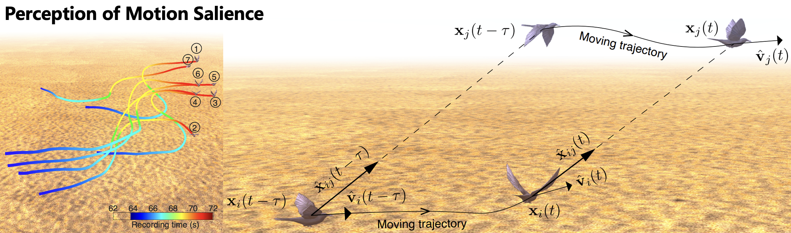
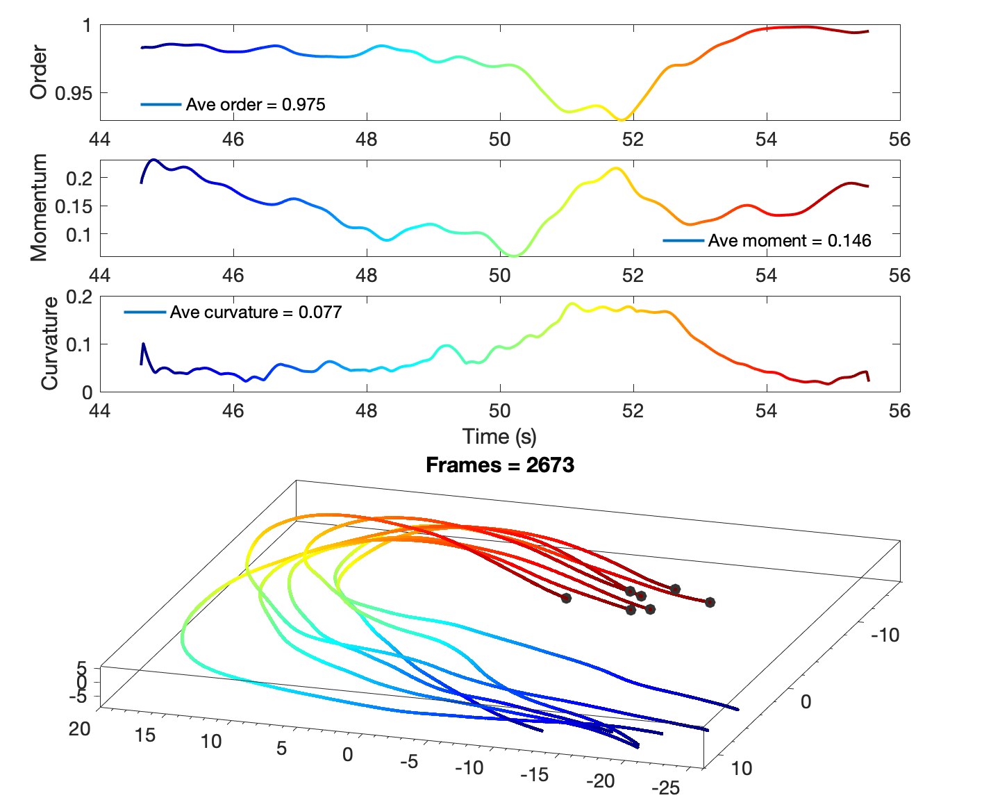
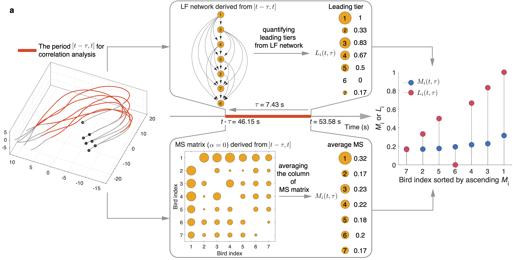

## 1. Data Collection and processing
To reveal the intrinsic interactions in collective motions, we leveraged the high-resolution movement data of bird flocks with different motion patterns (i.e., mobbing, circling and transit). The mobbing and transit datasets were obtained from the video recording of 3D movements of all individuals within flocks of wild jackdaws (*Corvus monedul*) in Cornwall, UK. The circling dataset contained 3D tracks reconstructed from video recordings of a flock of ∼1,800 chimney swifts (*Chaetura pelagica*) in the field when the swifts entered an overnight roost in Raleigh, USA. 
- The [mobbing flocks](http://www.nature.com/articles/s41467-019-13281-4) recorded the collective anti-predator events during which individuals gathered together to inspect and repel a predator (Fig.1a and Supplementary Video 1). 
- The [circling flocks](https://royalsocietypublishing.org/doi/10.1098/rspb.2016.2602) with hundreds of chimney swifts displayed the circling approach pattern from surrounding areas near a roost site (Fig.1b and Supplementary Video 2). 
- The [transit dataset](http://www.nature.com/articles/s41467-019-13281-4) showed the highly ordered and smooth movement of jackdaw flocks flying towards their winter roosts (Fig.1c and Supplementary Video 3). 

See Supplementary Sec.1 and Supplementary Fig.1 for detailed information about the data collection and processing of three datasets. In this work, we totally got 140, 94, and 1521 tracks of mobbing, circling, and transit flocks, respectively. The three datasets could be categorized into two kinds of motion patterns: the first two (mobbing and circling) displayed highly maneuverable motion, i.e., collective sharp turn to drive away predator or collective circling near a roost site, while the last one (transit) is much smoother and highly ordered to move towards the winter roosts (see Supplementary Sec.3 and Supplementary Figs.2-10 for the overview of flocking trajectories).

The three flocking datasets are provided from the original papers. In the folder of `data_original`, `mob_01.mat` contains the original flocking information. Accoding to our workflow of data processing, this original dataset could be trimmed into many continous tracks by code of `workflow_of_data_processing/Generate_tracks_filt_with_block_border_Jackdaw.m`. For example, `workflow_of_data_processing/Plot_Mobbing_of_Fig1a.m` plot the flocking trajectories shown in Fig.1a.

## 2. Using leader-follower relation matrix to classify sub-communities in the circling flocks 

As the original circling flocks record hundreds of swifts which are mixed together to behave the circling pattern near a roost site, Supplementary Fig.10a displays that the swifts form a few sub-communities due to different locations of individuals in the whole flock. It is consistent with the observation of sub-communities in Supplementary Video 2. For example, Supplementary Fig.10c shows the trajectories of those sub-communities. We found that the individuals in a sub-community are close to each other at the beginning of this video recording, and then they hover as a sub-group. Across different sub-communities shown in Supplementary Fig.10c, each sub-community is worth analyzing MS and LF instead of that of the whole flock. Therefore, the question is how to classify sub-communities of the 232 circling flocks shown in Supplementary Figs.7-9.

Interestingly, the LF relations could classify the whole circling flock into sub-communities, because different individual pairs with similar LF relations could demonstrate that those pairs have the similar leading or lag time of LF relations. For instance, after detecting the modularity of LF matrix derived from the flock shown in Supplementary Fig.10a, each module corresponds to a box in Supplementary Fig.10b and a 3D box in Supplementary Fig.10c. As both the row and column of LF relation matrix are the same, the intersection set of row and column of each module represents the individuals belonging to this module. Each 3D box in Supplementary Fig.10c shows the corresponding 3D trajectories of a module (also called sub-community). If the intersection set is null, this module is empty, i.e., empty boxes in Supplementary Fig.10c. Besides, we found that the value of $τ_{ij}^{\text{LF}}$ for those empty modules in Supplementary Fig.10b are almost either the largest (yellow) or the least (dark blue). 

In this work, we used the [BiMat](http://bimat.github.io/) (a Matlab code package to calculate the modularity and nestedness of complex networks) to calculate the modularity of LF relation matrix. Finally, the 232 circling flocks are classified into 1521 non-empty modules to be analyzed by our modeling framework. The code in `Modularity_of_Circling/Generate_Modularity_of_Trajectory_Hover_for_anyFrame.m` could generate the results shown in Supplementary Fig.10.

## 3. Correlation between LF and MS
According to Eq.(2) in the main text, we could construct MS matrix $M(t,\tau)=[M_{ij} (t,\tau)]_{(N\times N)}$  and derive the average MS of each individual $M_i (t,\tau)$ by averaging each column of $M(t,\tau)$. Moreover, besides the nestedness value capturing the hierarchy of LF relations at the group level, we also calculated the [local reaching centrality](http://dx.plos.org/10.1371/journal.pone.0033799) to quantify the leading tier of each individual in an LF network derived from a flock within the time period $[t-\tau,t]$, labelled as $L_i (t,\tau)\in[0,1]$ (see Methods). The larger the $L_i$, the higher the leading role of individual-i. For example, in the LF network of Fig.1d, bird-2 at the top, leading all the downstream individuals, has the largest $L_2=1$, while $L_7=0$ of bird-7 is the least because it locates at the lowest layer of the LF network. An in-depth study of the correlation between LF and MS enables us to disclose the motion characters during the formation process to answer a fundamental question of collective motions: what kind of motion characteristic does an individual possess to lead the flock? Leader’s motion character could be interpreted as the interaction rule about how the focal aligns with neighbors after perceiving their motions. For example, according to the mobbing flock shown in Fig.1a, we calculated the LF network and MS matrix $(\alpha=0)$ from a short period $[t-\tau,t]$ (Fig.3a), and then derived each individual’s leading tier $L_i (t,\tau)$ and average MS $M_i (t,\tau)$. Interestingly, the two vectors composed of $L_i (t,\tau)$ and $M_i (t,\tau)$ show a highly positive correlation. 

The code in folder of `LF_MS_correlation` could generate the results shown in Fig.3. And the code contains the calculation of LF and MS.

### Acknowledgements
There are several important works which support this project:
- [mobbing flocks](http://www.nature.com/articles/s41467-019-13281-4) 
- [circling flocks](https://royalsocietypublishing.org/doi/10.1098/rspb.2016.2602) 
- [transit dataset](http://www.nature.com/articles/s41467-019-13281-4) 
- [BiMat](http://bimat.github.io/): a Matlab code package to calculate the modularity and nestedness of complex networks
- [maxdistcolor](https://www.mathworks.com/matlabcentral/fileexchange/70215-maximally-distinct-color-generator/): generates an RGB colormap of maximally-distinct colors
- [NVJOB Simple Boids](https://github.com/nvjob/nvjob-boids): reconstuct the flocks of birds, fish and insects with [Unity](https://unity.com/)

### Licence
The source code is released under [GPLv3](https://www.gnu.org/licenses/) license.
